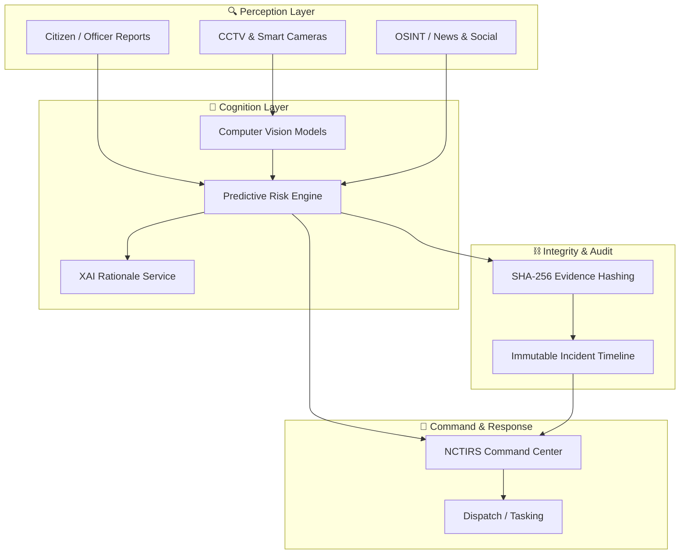

# 🛡️ NCTIRS – National Security & Smart Policing Intelligence Platform

[](https://github.com/arapgechina24-lgtm/NCTIRS)
[](https://github.com/arapgechina24-lgtm/NCTIRS/actions/workflows/ci.yml)
[](LICENSE)

**AI-Powered National Security & Smart Policing Intelligence Platform**

[Technical Whitepaper](./docs/TECHNICAL_WHITEPAPER.md) • [System Architecture](./docs/SYSTEM_ARCHITECTURE.md) • [Documentation](#-features) • [Getting Started](#-getting-started)

---

## 🏛️ Executive Summary

The **AI-Powered National Security and Smart Policing Intelligence Platform (NCTIRS)** is a sovereign intelligence and incident management platform that moves security agencies from reactive response to **proactive threat prevention**.

NCTIRS fuses:

- Live incident reports
- Smart surveillance and computer vision signals
- Geospatial crime patterns
- OSINT and sentiment indicators

into a **single operational picture** for commanders, analysts, and dispatch—backed by forensic-grade audit trails and explainable AI.

---

## 🎬 Demo

Run a full demo locally as a Command Center dashboard:

```bash
# Clone the repository
git clone https://github.com/arapgechina24-lgtm/NCTIRS.git
cd NCTIRS

# Install dashboard dependencies
npm install

# (Optional) Set up the Python AI engine
python3 -m venv venv && source venv/bin/activate
pip install -r requirements.txt
pip install -r requirements-local.txt

# Run development server
npm run dev
```

Visit `http://localhost:3000` to open the NCTIRS Command Center.
Visit `http://localhost:3000/usalama` to open the USALAMA APP citizen reporting portal.

For cloud deployment (Render) and database provisioning, see `DEPLOY_GUIDE.md` and `DEPLOY_VARS.md`.

---

## 🚀 Features

### 🎯 Command Center

- **Real-time Threat Map**: Heatmaps and incident overlays for high-risk zones.
- **Multi-Panel Intelligence Views**: Incidents, risk analytics, surveillance, and OSINT feeds.
- **Operational Filters**: Slice by county, incident type, severity, and time window.

### 🔍 Predictive Risk Engine

- **Regional Risk Score (0–100)** derived from historical crime geometry and contextual indicators.
- **Explainable Factors**: Time-of-day, incident density, critical infrastructure proximity, and sentiment.
- Support in the roadmap for **scenario simulations** (e.g., mock riot progression).

### 🎥 Smart Surveillance (Computer Vision)

- Integration points for **YOLOv8-style** object detection on CCTV feeds.
- Detection of **abandoned objects, weapons, and anomalous crowd behavior**.
- Hooks for automatically surfacing detections into the Command Center.

### 🧠 Explainable AI (XAI) Rationale

- Every material AI decision surfaces **contributing factors, confidence, and context**, reducing “black-box” risk.
- Designed to support **court-admissible** justification and internal review.

### 🔐 Forensic-Grade Audit Trails

- **SHA-256 hashing** for incident timelines and key artifacts.
- **Forensic IDs** that bind together events, analyst actions, and model outputs.
- A foundation for tamper-evident, end-to-end **chain-of-custody**.

---

## 📊 Compliance & Audit

NCTIRS is designed with **legal compliance and auditability** from day one:

- Aligned with the **Kenya Data Protection Act (2019)** for handling sensitive, person-linked data.
- Supports audit trails suited for **internal affairs, judicial oversight, and external regulators**.
- Documentation in:
  - `docs/DATA_STRATEGY.md`
  - `docs/TECHNICAL_WHITEPAPER.md`
  - `docs/USER_MANUAL.md`

---

## 🛠️ Tech Stack

| Category  | Technology                                        |
|----------|----------------------------------------------------|
| Framework | Next.js 16 (App Router)                           |
| Language  | TypeScript 5, React 19                            |
| Styling   | Tailwind CSS 4, Shadcn UI                         |
| AI Engine | Python 3.9 (FastAPI, scikit-learn, NLTK, CV stack)|
| Database  | PostgreSQL + Prisma ORM (geospatial-ready)        |
| Auth      | NextAuth.js v5 with Prisma adapter                |
| CI/CD     | GitHub Actions (Node + Python + semantic-release) |

Detailed diagrams and contracts:

- `docs/SYSTEM_ARCHITECTURE.md`
- `docs/ERD.md`
- `docs/API.md`

---

## 🧱 Architecture

At a high level, NCTIRS is composed of:

1. **Perception Layer** – incident reports, CCTV feeds, OSINT, and telemetry.
2. **Cognition Layer** – risk scoring, XAI rationale, and alert prioritization.
3. **Integrity & Response Layer** – hashing, audit logs, and operational dispatch.



See `docs/SYSTEM_ARCHITECTURE.md` for full sequence diagrams and data flows.

---

## 🔌 Inter-Agency Integration (USALAMA APP Sync)

NCTIRS acts as the central fusion hub for citizen reports originating from the **USALAMA APP** portal.

### Sync Flow
1. **Citizen Report**: A citizen submits a report on the USALAMA APP portal (ai-policing-platform).
2. **Secure Forwarding**: USALAMA APP forwards the incident to NCTIRS's `/api/incidents` endpoint using a secure `X-Sync-Token`.
3. **Automated Cognition**: NCTIRS's AI Engine immediately triggers an analysis:
   - **Risk Scoring**: Calculates a confidence-weighted risk level.
   - **XAI Rationale**: Generates human-readable justification for the score.
   - **Forensic Fingerprinting**: Hashes the result for immutable audit trails.
4. **Command View**: The incident appears in the NCTIRS dashboard for commander review.

### Configuration
To enable sync, ensure both platforms share the same `NCTIRS_SYNC_TOKEN` in their respective environment variables.


## 📜 Legal Compliance

> **Disclaimer:** NCTIRS is a **demonstration and research platform**. Any production roll-out requires formal legal, security, and privacy review.

The design is informed by:

- 🇰🇪 **Kenya Computer Misuse and Cybercrimes Act (2018)** – incident handling and CII protection.
- 🇰🇪 **Kenya Data Protection Act (2019)** – PII handling, retention, and access controls.
- 🌍 Common international security frameworks (e.g. **NIST-style controls**), discussed in the technical whitepaper.

---

## ⚙️ Environment Variables

Core environment configuration (see `DEPLOY_VARS.md` for details and examples):

| Variable       | Required | Description                                                      |
|---------------|----------|------------------------------------------------------------------|
| `DATABASE_URL`| Yes      | PostgreSQL connection string used by Prisma.                    |
| `AUTH_SECRET` | Yes      | 32-byte secret for NextAuth session encryption.                 |
| `NEXTAUTH_URL`| Yes      | Public URL of the deployment (e.g. `https://nctirs.onrender.com`).|

To configure these on Render, follow the checklist in `DEPLOY_VARS.md`.

---

## 🗺️ Roadmap

The detailed roadmap lives in `ROADMAP.md`. At a glance:

| Phase   | Focus Area                         | Status                |
|--------|-------------------------------------|-----------------------|
| Sprint 1 | Architecture & Data Engineering   | In progress / documented |
| Sprint 2 | Core AI Engine (risk, CV, NLP)   | Planned / in progress |
| Sprint 3 | Command Center & Integrations    | Partially complete    |
| Sprint 4 | Testing, Forensics & Demo Prep   | Upcoming              |

See `ROADMAP.md` for sprint dates, risks, and milestones.

---

## 🤝 Contributing

Contributions that improve **security posture, reliability, UX, or AI explainability** are welcome.

Before opening a pull request:

- Read `CONTRIBUTING.md` for branching conventions, commit styles, and PR requirements.
- Use **synthetic or mock data only**; do not upload real operational or personally identifiable data.
- For suspected security issues, follow the private disclosure process in `SECURITY.md`.

---

## 📄 License

This project is licensed under the **MIT License** – see `LICENSE` for full terms.

By contributing, you agree that your contributions will be licensed under the same MIT license.

---

> “In national security, time is the only currency. NCTIRS buys time.”

